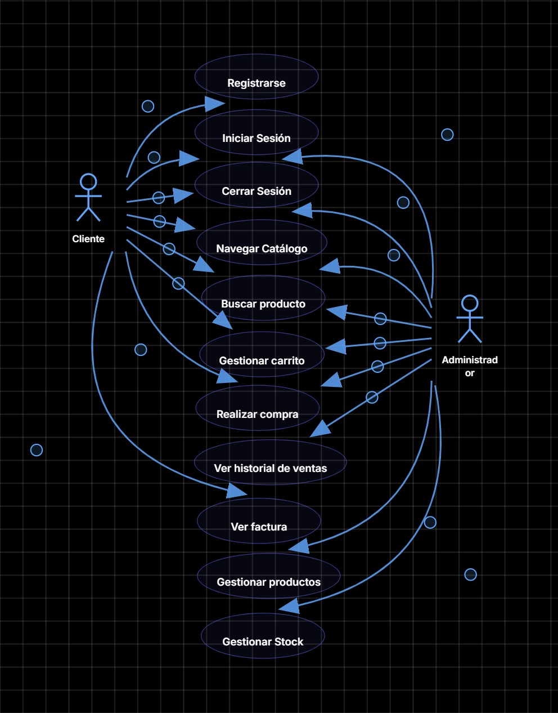
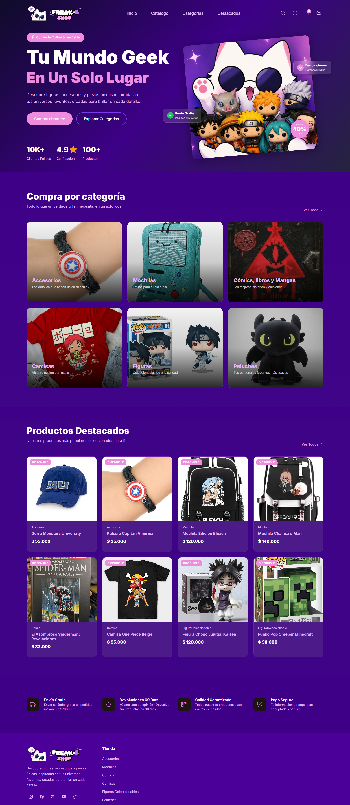
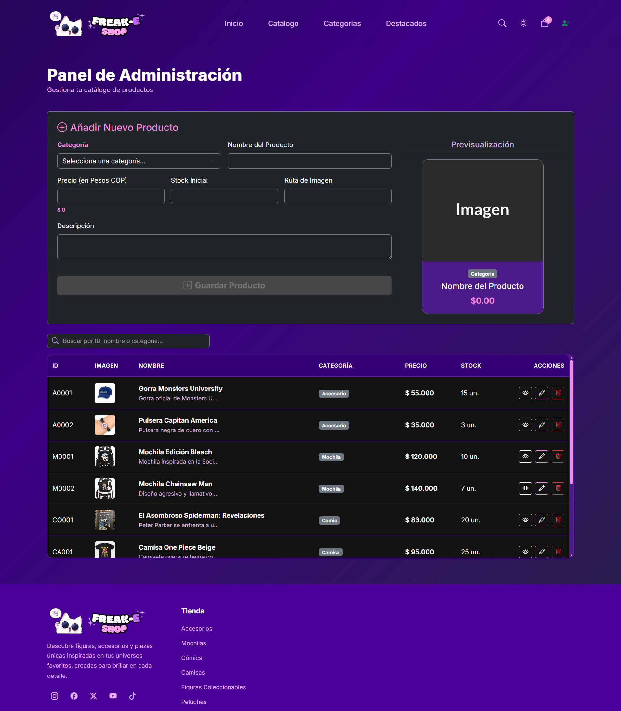
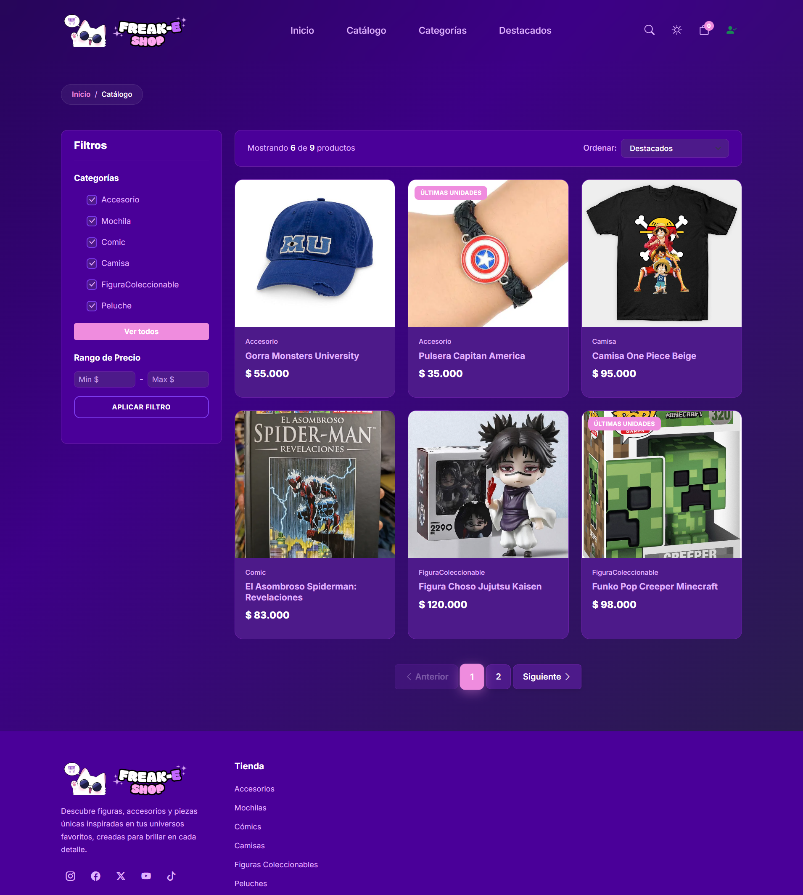
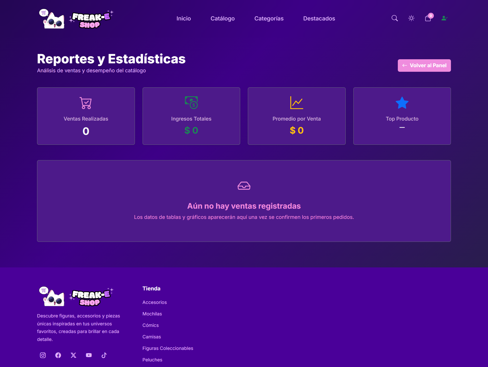

# 🛒 Freak-E-Shop

> Proyecto final — Java POO · [1604] · [2026]

## 👥 Integrantes

| Nombre | GitHub |
|--------|--------|
| Miguel Angel Benítez Moncaleano | [@MiguelAnBM](https://github.com/MiguelAnBM) |
| Delany Yulieth Mendoza Castillo | [@DelaMendoza](https://github.com/DelaMendoza) |
| Jady Luz Ramírez Benítez | [@jadyramirez04](https://github.com/jadyramirez04b-ops) |
  Carlos Arturo Sánchez Villarreal | [@CarloSanchez66](https://github.com/CarloSanchez66) |
---

## 📋 Descripción

### 🛍️ Freak-E-Shop — Tu mundo geek en un solo lugar

¿Eres fan del anime, las películas y las series? Entonces **Freak-E-Shop** no es sólo una tienda… es tu próxima obsesión. Esta plataforma e-commerce está diseñada para ofrecer una experiencia de compra rápida y segura, donde cada producto conecta con la cultura geek que amas.

Desde ropa temática hasta figuras coleccionables, pasando por mochilas, peluches y accesorios únicos, aquí encontrarás todo lo que necesitas para expresar tu estilo y pasión.

---

### ✨ ¿Por qué elegir Freak-E-Shop?

#### 🎯 Catálogo que engancha
Explora una amplia variedad de productos inspirados en tus universos favoritos:
- 👕 Camisetas con diseños exclusivos  
- 🎒 Mochilas y accesorios funcionales con estilo geek  
- 🧸 Figuras coleccionables de alta calidad  
- 🎬 Artículos de anime, películas y series icónicas  

#### ⚙️ Tecnología moderna y confiable
Desarrollada con **Spring Boot** y **Thymeleaf**, la plataforma garantiza:
- Renderizado eficiente del lado del servidor  
- Navegación rápida y sin complicaciones  
- Arquitectura robusta y escalable  

#### 🔐 Seguridad que inspira confianza
- Protección contra vulnerabilidades comunes  
- Manejo seguro de errores y grandes solicitudes
- Patrón de arquitectura MVC seguro

#### 💾 Persistencia de datos sólida
- Guardado de facturas de compra íntegro 
- Carrito de compras funcional y almacenamiento eficiente  
- Estructura preparada para crecimiento y alto volumen  

#### 🧩 Experiencia fluida y amigable
- Interfaz clara, intuitiva y atractiva  
- Flujo de compra sencillo (explora, añade, compra)  
- Diseño pensado para usuarios reales, no sólo desarrolladores  

#### 🚀 Fácil de desplegar y extender
- Configuración simplificada gracias a Spring Boot  
- Código limpio y organizado bajo el patrón MVC  
- Ideal para escalar o adaptar a nuevos requerimientos  

---

💡 **Freak-E-Shop** no es solo una tienda online: es una experiencia pensada para fans, construida con tecnología sólida y enfocada en rendimiento, seguridad y usabilidad.

---

🔥 *Viste tu fandom. Colecciona tus historias. Vive Freak-E-Shop.*

---

## 🚀 Cómo ejecutar

### Requisitos
- Java JDK 17+
- Apache NetBeans 22+

### Pasos
```bash
# 1. Clonar
git clone (https://github.com/MiguelAnBM/ecommerce-freak-e-shop.git)

# 2. Abrir la carpeta app en Apache Netbeans (22+)
File -> Open Project -> freak_e_shop

# 3. Ejecutar la clase principal (FreakEShopApplication)
Ruta: Source Packages -> com.freakeshop.freak_e_shop
F6 dentro de la clase FreakEShopApplication

# 4. Abrir el navegador y escribir lo siguiente en la URL
http://localhost:8080
```

---

## 🏗️ Tecnologías usadas

| Categoría | Tecnología elegida |
|-----------|-------------------|
| Lenguaje | Java |
| UI / Framework | Spring Boot + Thymeleaf |
| Persistencia | Archivos .txt |
| IDE | Apache NetBeans |

---

## 🧩 Diagrama de clases UML


---

## 📐 Diagrama de casos de uso



---

## 🎯 Funcionalidades implementadas

- [✅] Gestión de productos
- [✅] Gestión de usuarios / clientes
- [✅] Carrito de compras
- [✅] Flujo de pedido y pago
- [✅] Historial de pedidos
- [✅] Web funcional
- [✅] Persistencia de datos
- [✅] Barra de búsqueda funcional
- [✅] Cambio de tema oscuro/claro
---

## 📐 Conceptos POO aplicados

| Concepto | Clase / método donde se aplica |
|----------|-------------------------------|
| Herencia | Cliente y Administrador extienden Usuario. Camisa, FiguraColeccionable, Mochila, Peluche, Comic y Accesorio extienden Producto |
| Encapsulación |Todos los atributos de Usuario y Producto son private; acceso controlado mediante getters y setters |
| Polimorfismo | ProductoService.obtenerTodos() retorna una List<Producto> con instancias mezcladas de sus subclases; CarritoService.obtenerTotal() opera sobre ellas uniformemente a través de la referencia Producto |
| Abstracción | Usuario y Producto son clases abstractas que dominan las clases que las heredan en el paquete model |
| Colecciones | CarritoService usa LinkedHashMap<String, Integer> para los ítems. PedidoService y ProductoService usan ArrayList para listas de pedidos y productos |
| Excepciones | Algunos setters lanzan IllegalArgumentException. Los repositorios capturan IOException al leer y escribir archivos |

---

## 🖼️ Capturas





